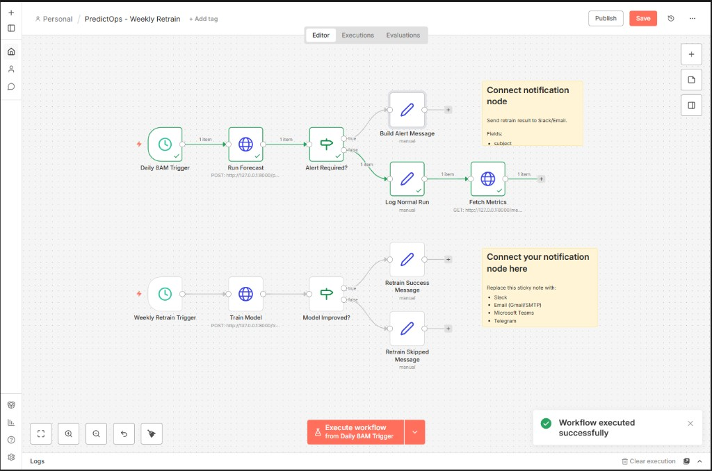
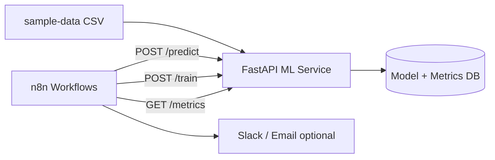

# PredictOps

**ML forecasting + n8n automation for operational workload planning.**

PredictOps learns from historical daily metrics (e.g. support tickets), forecasts the next 7 days, triggers alerts when volume exceeds a threshold, and retrains the model weekly with MAPE-based promotion.

Built as a portfolio-grade **Applied ML + MLOps-lite + workflow automation** project.

## Demo

Successful end-to-end run — daily forecast + weekly retrain workflows (all nodes green):



---

## Problem & solution

| Problem | Solution |
|---------|----------|
| Teams react after ticket spikes | 7-day ML forecast |
| Manual checks are inconsistent | n8n scheduled workflows |
| Models drift over time | Weekly retrain + promote only if MAPE improves |
| No audit trail | SQLite metrics log + API `/metrics` |

**Use case:** helpdesk, SaaS ops, IT support, e-commerce order volume, any **daily count** time series.

---

## Features

- **Time-series forecasting** — GradientBoosting with lag & rolling features (scikit-learn)
- **REST ML API** — FastAPI (`/train`, `/predict`, `/metrics`, `/health`)
- **Alert logic** — threshold on average or peak forecast
- **Weekly retrain** — new model promoted only when validation MAPE improves
- **n8n orchestration** — daily forecast + weekly retrain workflows (importable JSON)
- **Run logging** — train/predict history in SQLite

---

## Architecture



```text
Historical CSV  →  Train (ML)  →  Predict 7 days  →  Threshold check  →  Alert or log
                              ↘  Weekly retrain (MAPE gate)  ↗
```

---

## Tech stack

| Layer | Technology |
|-------|------------|
| ML | Python, pandas, scikit-learn |
| API | FastAPI, uvicorn |
| Automation | n8n (self-hosted) |
| Metrics | SQLite |
| Data | CSV (`date`, `value`) |

---

## Project structure

```text
predictops/
├── ml-service/
│   ├── main.py              # FastAPI endpoints
│   ├── forecaster.py        # Train, predict, metrics engine
│   └── requirements.txt
├── sample-data/
│   └── support_tickets.csv  # 180 days demo data
├── workflows/
│   ├── predictops-daily.json    # Forecast + alert routing
│   └── predictops-retrain.json    # Weekly retrain
├── Dockerfile               # Optional Docker ML image
├── docker-compose.yml       # Optional n8n + ml-api
├── start-all.bat            # Windows: start API + n8n
├── start-ml-api.bat         # Windows: ML API only
└── README.md
```

---

## Results (demo dataset)

On included `support_tickets.csv` (180 days):

| Metric | Typical value |
|--------|----------------|
| Validation MAPE | ~0.48% |
| Forecast horizon | 7 days |
| Default alert threshold | 45 tickets/day |
| Minimum training rows | 30 days |

---

## Quick start

### Prerequisites

- Python 3.10+
- [n8n](https://docs.n8n.io/hosting/installation/npm/) (`npm install -g n8n`) — optional for automation
- Windows: use **`127.0.0.1`** in n8n HTTP nodes (avoids IPv6 `localhost` issues)

### 1. Clone & install ML service

```bash
git clone https://github.com/YOUR_USERNAME/predictops.git
cd predictops/ml-service
python -m venv .venv

# Windows
.venv\Scripts\activate
pip install -r requirements.txt

# macOS / Linux
source .venv/bin/activate
pip install -r requirements.txt
```

### 2. Start API

```bash
uvicorn main:app --host 0.0.0.0 --port 8000
```

**Windows shortcut:** double-click `start-all.bat` (starts API + n8n).

Verify: http://127.0.0.1:8000/health → `{"status":"ok"}`

Interactive docs: http://127.0.0.1:8000/docs

### 3. Train & predict (first run)

```bash
# Train
curl -X POST "http://127.0.0.1:8000/train"

# Predict next 7 days
curl -X POST "http://127.0.0.1:8000/predict?horizon=7&threshold=45"

# Metrics
curl "http://127.0.0.1:8000/metrics"
```

**PowerShell:**

```powershell
Invoke-RestMethod -Method POST "http://127.0.0.1:8000/train"
Invoke-RestMethod -Method POST "http://127.0.0.1:8000/predict?horizon=7&threshold=45"
```

> Do **not** open `/predict` or `/train` in the browser address bar (GET → `405 Method Not Allowed`). Use `/docs` or curl.

### 4. n8n setup

```bash
npx n8n
```

Open http://127.0.0.1:5678 → **Import** from `workflows/`:

1. `predictops-daily.json`
2. `predictops-retrain.json`

**HTTP node URLs (local n8n on same PC):**

| Node | Method | URL |
|------|--------|-----|
| Run Forecast | POST | `http://127.0.0.1:8000/predict?horizon=7&threshold=45` |
| Fetch Metrics | GET | `http://127.0.0.1:8000/metrics` |
| Train Model | POST | `http://127.0.0.1:8000/train` |

1. Run **POST /train** in API docs once  
2. In n8n: **Run Forecast** → **Execute step** → green  
3. **Execute workflow** on daily + weekly flows  
4. Optional: add Gmail/Slack after **Build Alert Message**  
5. Toggle **Active** for scheduling  

---

## API reference

| Method | Path | Description |
|--------|------|-------------|
| GET | `/` | Service info & endpoint list |
| GET | `/health` | Health check |
| GET | `/docs` | Swagger UI |
| POST | `/train` | Train model; promote if MAPE improves |
| POST | `/predict` | Forecast + `alert_required` flag |
| GET | `/metrics` | Model version, MAPE, recent runs |

**`/predict` query params:** `horizon` (default 7), `threshold` (default 45), `csv_path` (optional)

**`/train` query params:** `csv_path` (optional)

---

## Data format

`sample-data/support_tickets.csv`:

```csv
date,value
2025-01-01,29
2025-01-02,24
```

| Column | Type | Description |
|--------|------|-------------|
| `date` | YYYY-MM-DD | Day |
| `value` | number | Daily count (tickets, orders, incidents, etc.) |

Replace with your own export — keep the same schema. **≥30 rows** required to train; **90–180+** recommended.

---

## Docker (optional)

Requires [Docker Desktop](https://www.docker.com/products/docker-desktop/).

```bash
docker compose up -d --build
```

- API: http://127.0.0.1:8000  
- n8n: http://127.0.0.1:5678  

Inside Docker n8n, use `http://ml-api:8000/...` instead of `127.0.0.1`.

---

## Portfolio demo script (~90 seconds)

1. Show CSV — historical daily tickets  
2. `/docs` → **POST /train** → MAPE ~0.48%  
3. **POST /predict** → 7-day JSON forecast  
4. n8n **Execute workflow** — green nodes  
5. `/metrics` — run history  

**Elevator pitch:**

> *PredictOps forecasts operational load one week ahead and automates alerts and weekly model retraining with MAPE tracking — Python ML + n8n orchestration.*

---

## Resume bullet

> Built **PredictOps**: scikit-learn forecasting API (FastAPI) with 7-day predictions, threshold alerts, and weekly MAPE-gated retraining; orchestrated via n8n for scheduled ops automation.

---

## Roadmap

- [ ] Google Sheets / CRM data source
- [ ] Slack/Gmail nodes pre-wired in workflows
- [ ] Model drift monitor (MAPE degradation alerts)
- [ ] Prophet / LightGBM model option
- [ ] Cloud deploy (Railway, Render)

---

## Troubleshooting

| Issue | Fix |
|-------|-----|
| n8n `connection refused` on Run Forecast | Start API; use `127.0.0.1` not `localhost` in HTTP nodes |
| `405 Method Not Allowed` on `/predict` | Use POST via `/docs` or n8n — not browser address bar |
| `409 No trained model` | Run `POST /train` first |
| Port 8000 / 5678 in use | Service already running — open `/health` or n8n UI |
| `host.docker.internal` in browser | Wrong — only for Docker-internal calls |
| n8n 403 Rudder logs | Telemetry blocked — safe to ignore; set `N8N_DIAGNOSTICS_ENABLED=false` |

**LAN fallback (if `127.0.0.1` fails in n8n):** use your PC IP from `ipconfig`, e.g. `http://192.168.1.x:8000/predict?horizon=7&threshold=45`

---

## License

MIT — see [LICENSE](LICENSE).

---

## Author

Portfolio project — **Applied ML + n8n automation**.  
Replace `YOUR_USERNAME` in clone URL when publishing to GitHub.
